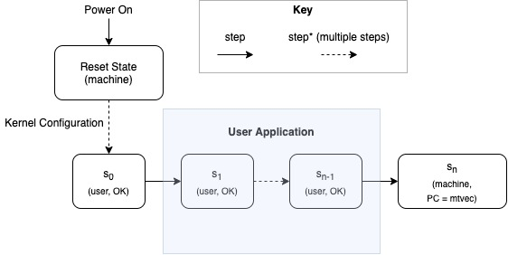

# Towards Proving Application Isolation for Cryptocurrency Hardware Wallets
Andrew Shen

## 1 Introduction
Modern personal computers (PCs) often contain numerous security vulnerabilities due to bugs in their complex operating systems, which have millions of lines of code. In other words, the size of the Trusted Computing Base (TCB), or the code assumed to be implemented correctly, is relatively large, and as a result, writing a bug-free operating system on the scale of Linux or Windows is nearly impossible. However, many applications that might run on the PC including cryptocurrency or banking software require strong guarantees to ensure secure transactions. The security guarantees provided by PCs are insufficient for these security sensitive operations. Hardware wallets, small devices with an independent operating system, provide the capabilities to isolate these sensitive operations and complete them securely. Hardware wallets have a screen and buttons used to authorize and sign transactions and connect to the PC through a USB port. This allows for the application to be split into two parts where the majority of the application still runs on the PC, but the secure transaction approval step occurs on the hardware wallet. Figure 1.1 illustrates this process. The private keys used to sign the transactions are stored solely on the hardware wallet, completely isolating them from the PC. Because hardware wallets only need to perform a small subset of the operations that a PC would, they use a significantly smaller operating system. With a smaller codebase and TCB, there would be less room for attacks and fewer bugs. Rather than trusting the PC, the user only needs to trust that the hardware wallet works as intended. For example, a compromised PC would be unable to steal Bitcoin from a hardware wallet as it would be unable to access the confidential information stored solely on the hardware wallet. If the PC tried to perform a malicious action, the hardware wallet would receive the transaction and then display the exact transaction it received on the screen. This way if the compromised PC requested a malicious transaction, for example, the user could decline said transaction. There is no other method of signing the transaction other than using the private keys, which reside solely on the hardware wallet.


**Figure 1.1.** A diagram of a hardware wallet receiving and approving a transaction from the PC after the user has physically confirmed the transaction shown on the display using the buttons on the hardware wallet.

Although operating systems on hardware wallets are less complex than those on PCs, they are still prone to error and have many thousands of lines of code. For example, security vulnerabilities have been previously discovered in modern hardware wallets such as Ledger. These vulnerabilities range from hardware misconfiguration bugs that can be abused without even leaving user mode to system call argument validation bugs in the kernel. One method used to eliminate these sorts of bugs is by using formal verification, a technique used to reason about the behavior of a program. Prior work such as HV6 and Serval tackle verifying a desktop-style operating system by using push-button formal verification. However, these previous works only reason about individual system calls and do not reason about code that runs between these system calls in user mode. One bug that Serval would not detect would be a misconfigured physical memory protection (PMP) register, which would allow user code to access memory that it should not. We seek to reduce the TCB further by using formal verification to eliminate certain classes of bugs that could be exploited while running in user mode. One such security property would be guaranteeing that user code is unable to modify any memory that it is not permitted to access. To accomplish this task, we build a kernel in RISC-V, which represents a simplified version of an actual hardware wallet kernel. In addition, we also build a QEMU-like symbolic machine emulator to reason about the behavior of our kernel. This machine emulator differs from QEMU in that it can reason about symbolic values in the machine state, essentially allowing us to reason about machine execution even when some aspects such as the user code are unknown, which allows us to reason about arbitrary user mode code. This enables us to state and prove important security properties such as the inability of code running in user mode to change RAM of protected regions. We prove that applications cannot tamper with the isolation set up while executing in user mode. With proofs further reasoning about system calls, we could complete an end-to-end proof about the system's execution. Although this is not yet an end-to-end correctness proof, we prove important properties that are also useful. 

## 2 Approach
### Subsection: Kernel Design
We built a kernel similar to one found in a real hardware wallet. We design our kernel to have the following features: the ability to download, load, and run different applications. Also, we use a smaller codebase to make debugging and reasoning easier. Our target hardware, like other hardware wallets, has no virtual memory support. To isolate the kernel from the user application we use RISC-V M-mode as our privileged level with unrestricted access to memory and use RISC-V U-mode for running user applications, which has only restricted access to memory due to our PMP register setup. The kernel begins with turning on and booting the kernel, where several control register configurations occur to set up proper privilege level settings. These boot-time operations include configuring the PMP registers in such a way that user applications can only access a predefined region of memory they are permitted to use and giving the user the choice to download an application or load an existing application to be run. Then, the kernel executes the application that was selected by the user during boot time. After finishing the execution of this program, the kernel stops, and to run another application, the user must restart the kernel by physically powering off and on the device; the kernel can only run a single application within a single run. This simplifies the design of our kernel making it easier to reason about while maintaining the same functionality. Furthermore, our kernel does not need to support the same multiplexing functionality that desktop PCs have as we only ever need to run one cryptocurrency application at one time.
### Subsection: Verification
Our goal is to prove that our applications are isolated from one another. To prove this property about our kernel, we must show that we can set up our kernel in such a way that by the time we enter use mode, the application is running in user mode and cannot modify confidential memory. We use the PMP registers to restrict the user application memory access as well as configure other critical registers at boot time (mtvec, mstatus, etc) at boot time to create this state, which we will refer to this configuration of kernel registers as being “OK” (Figure 2.1). 

```
mtvec = 0x0000000080000080
pmpcfg0 = 0x000000000000001f
pmpcfg2 = 0x0000000000000018
pmpaddr0 = 0x000000002000bfff
pmpaddr1 = 0x0
pmpaddr1 = 0x0
pmpaddr2 = 0x0
pmpaddr3 = 0x0
pmpaddr4 = 0x0
pmpaddr5 = 0x0
pmpaddr6 = 0x0
pmpaddr7 = 0x0
pmpaddr8 = 0x7fffffffffffffff
pmpaddr9 = 0x0
pmpaddr10 = 0x0
pmpaddr11 = 0x0
pmpaddr12 = 0x0
pmpaddr13 = 0x0
pmpaddr14 = 0x0
pmpaddr15 = 0x0
```

**Figure 2.1.** We define a state to be “OK” if the state has specific registers configured as shown above.

Also, we must show that after booting up into this “OK” state and switching to user mode for execution of the application, that any instruction running in user mode causes exactly one of the following two cases to occur: either the kernel remains in user mode and the kernel maintains the “OK” property, or the kernel switches to kernel mode and begins executing at the location predefined by the mtvec register, which handles system calls (Figure 2.2). This corresponds to a standard inductive proof where the base case is setting up our kernel into the “OK” state and the inductive step proves that no individual instruction can tamper with protected RAM.



**Figure 2.2.** A diagram of the workflow of our kernel. The kernel configures during the boot sequence until it reaches state s0, where s0 is the state of the machine immediately after the kernel boots up. Then the kernel runs for an arbitrary number of steps n, where it remains in U-mode and “OK” until it reaches state sn at which point it switches to M-mode and begins executing at the address defined by mtvec.

Though we do not reason about system calls in our work, the system call handler could be verified similarly to Serval and allows our user application to perform different operations such as gaining access to the UART, which handles input and output. Since any application is the composition of many instructions, our proof covers all possible user applications that could be run on the kernel including those with illegal instructions. To complete the proof of these properties, we need to employ symbolic values, which will allow us to reason about unknown values in our machine. For the base case, only some registers and regions of memory are defined, which allows us to use symbolic values to represent the rest of the undefined parts of the machine. In the inductive step, we use symbolic values to represent key parts of the machine including the program counter and the user application region of memory. This symbolic memory allows us to read an arbitrary instruction from an arbitrary address and execute one instruction from our current state s generating a new state s’. Using these two states, we can assert that the confidential memory remains unchanged despite running this arbitrary instruction on the address. If our assertion holds and there exist no values for which the symbolic variables could be such that the memory is changed between s and s’, then this implies that it is not possible under any circumstance that the memory was changed. Furthermore, we can extend this to reason about the privilege level. We can assert that either the mode is unchanged and remains in user mode or exits user mode and begins executing at the address predetermined by the mtvec register. This proof can be written as a more formal mathematical formula as shown in Figure 2.3.

Base Case: 
```
OK(s0), where s0 is the machine state immediately after the boot sequence.
```
Induction Case:
```
∀s, s′ : OK(s) ⟹ s′ = step(s) ⟹ is_user(s′) ∧ OK(s) ⟹ 
(is_user(s′) ∧ OK(s′)) ∨ (is_m(s′) ∧ pc(s′) = mtvec(s))
```
**Figure 2.3.** The proof expressed in more formal terms using mathematical notation.

### Subsection: Symbolic RISC-V Machine Emulator
To implement a machine emulator that works with symbolic variables, we turn to the Rosette language, an extension of the Racket language, which allows us to lift regular Racket code to be able to operate with symbolic values. We can write the kernel emulator in Racket and use Rosette to lift that emulator to function as a symbolic emulator capable of operating on arbitrary instructions. Mirroring the implementation of a regular machine emulator, the workflow of the emulator, we separate the execution of each instruction into three functions: fetch, decode (Figures 2.4 and 2.5), execute (Figure 2.6). The fetch functions extracts the raw bits that make up the instruction from RAM. The next function, decode, decodes those raw bits and based on the RISC-V specification, interprets which instruction and parameters to run. The final function, execute, emulates the decoded instruction and executes it on our machine state updating all necessary values such as the program counter. These functions are combined in the step function (Figure 2.7) to make up what we refer to as applying one “step” on our state in Figures 2.1 and 2.2.

```
(define (decode m b_instr)
	(define instr null)
	(define opcode (extract 6 0 b_instr))
	(define fmt (get-fmt m opcode))
	(cond
		[(eq? fmt 'R)
			(decode-R m b_instr)]
		[(eq? fmt 'I)
			(decode-I m b_instr)]
		[...]
		[else
			(illegal-instr m)]))
(provide decode)
```
**Figure 2.4.** A snippet of the `decode` function used to retrieve the instruction and parameters from a byte string.

```
(define (decode-R m b_instr)
	(define op null)
	(define rd (extract 11 7 b_instr))
	(define funct3 (extract 14 12 b_instr))
	[...]
	(define valid null)
	(cond
		[(and (bveq funct3 (bv #b000 3))
			(bveq funct7 (bv #b0000000 7)))
			(list 'add rd rs1 rs2)]
		[(and (bveq funct3 (bv #b000 3))
			(bveq funct7 (bv #b0100000 7)))
			(list 'sub rd rs1 rs2)]
		[...]
		[else
			(illegal-instr m)]))
```
**Figure 2.5.** A snippet of a utility function used by the main `decode` function to decode “R-Format” instructions, one of the few types of formats possible. 

```
(define (execute instr m)
	(define opcode (list-ref instr 0))
	(define pc (get-pc m))
	(cond
		[(eq? opcode 'lb)
			(define rd (list-ref-nat instr 1))
			(define v_rs1 (gprs-get-x m (list-ref-nat instr 2)))
			[...]
			(define val (sign-extend (machine-ram-read m adj_addr 1) (bitvector 64)))
			(gprs-set-x! m rd val)
			(set-pc! m (bvadd pc (bv 4 64)))
			instr]
		[(eq? opcode 'sb)
			(define v_rs1 (gprs-get-x m (list-ref-nat instr 1)))
			[...]			
			(define success (machine-ram-write! m adj_addr v_rs2 8))
			instr])]))
```
**Figure 2.6.** A snippet of the `execute` function, which takes a decoded instruction and executes it, applying the result on the state of the machine `m`.

```
(define (step m)
	(define next_instr (get-next-instr m)) ; fetch raw instruction
	(define decoded_instr (decode m next_instr))
	(execute decoded_instr m))
```
**Figure 2.7.** The `step` function is analogous to the `step` referenced by the proof. Each step fetches, decodes, and executes one instruction from the machine `m` RAM.

### Subsection: Challenges
Oftentimes, due to the nature of Rosette, it can be beneficial to express certain values or data in different ways, which are easier for Rosette to generate simpler terms. One such example of this is the memory, which the symbolic machine emulator maintains. At first glance, it might seem intuitive to use an array representation for the memory, which is actually quite good for quick memory reads and writes when simulating actual code with concrete values. The major pitfall with this implementation becomes apparent when proving the unchanged confidential memory aspect of our proof. To completely verify that the entire region of confidential memory is unchanged, it is necessary to prove that each individual address remains unchanged. This results in the time to run our proof growing linearly with the size of the array and subsequently, the size of the RAM. Figure 2.9 demonstrates the issue with writes to memory using symbolic addresses. When we try to run the proof with 128 megabytes of RAM, we find that it takes an unreasonable amount of time to complete the proof and therefore, turn to an alternative implementation. We instead decide to use an uninterpreted function representation of memory where memory is represented as a function that takes an address and returns the value at that address. Then each time we wish to write a value v to an address a, we essentially wrap our current memory function in an if case that returns the value v if the user tries to get address a and the old memory function applied to the address if the address is not a. The Racket implementation of these two memory representations is described in Figure 2.8. Furthermore, the benefits of using uninterpreted function based memory is illustrated in the constant size term produced even after writing to an address as shown in Figure 2.9.

/// Example below is memory representations
```
(define (uf-memory-write! mem addr val)
  (lambda (addr*)
    (if (bveq addr addr*)
      val
      (mem addr*))))

(define (uf-memory-read mem addr)
  (mem addr))

(define (array-memory-write! mem addr val)
  (vector-set! mem addr val))

(define (array-memory-read mem addr)
  (vector-ref mem addr))
```
**Figure 2.8.** Rosette implementation of read and write for array-based memory and uninterpreted function (uf) based memory.

```
(define array_memory (vector 0 1 2))
(define-symbolic* idx integer?)
(define-symbolic* pos val integer?)

(printf "Before Write: ~a~n" (array-memory-read array_memory idx))
(array-memory-write! array_memory pos val)
(printf "After Write: ~a~n" (array-memory-read array_memory idx))

; >>> Before Write: (ite* (⊢ (= 0 idx$0) 0) (⊢ (= 1 idx$0) 1) (⊢ (= 2 idx$0) 2))
; >>> After Write: (ite* (⊢ (= 0 idx$0) (ite (= 0 pos$0) val$0 0)) (⊢ (= 1 idx$0) (ite (= 1 pos$0) val$0 1)) (⊢ (= 2 idx$0) (ite (= 2 pos$0) val$0 2)))

(define uf_memory (fresh-symbolic fnmem (~> integer? integer?)))
(uf-memory-write! uf_memory 0 0)
(uf-memory-write! uf_memory 1 1)
(uf-memory-write! uf_memory 2 2)

(printf "Before Write: ~a~n" (uf-memory-read uf_memory idx))
(uf-memory-write! uf_memory pos val)
(printf "After Write: ~a~n" (uf-memory-read uf_memory idx))

; >>> Before Write: (app fnmem$0 idx$0)
; >>> After Write: (app fnmem$0 idx$0)
```
**Figure 2.9.** An example demonstrating how terms generated from reading and writing to array based memory are much larger and complex than those generated from uninterpreted function based memory. In this example, both memory representations begin with the values 0, 1, and 2 in the index 0, 1, and 2 respectively, then write the symbolic integer `val` to position `pos` in the memory representation. The print statements corresponding to `Before Write:` and `After Write:` refer to the terms generated by reading from a symbolic index. The array based memory term grows significantly, while the uninterpreted function based memory term remains constant.

## 3 Evaluation
We evaluate our work on two factors: whether or not the verification terminated in a reasonable amount of time and which bugs were eliminated by our proof. For reasonable machine settings, notably 1 MB of RAM, both the base case and the recursive of the proof finish execution in roughly 25 minutes and 5 seconds respectively. With respect to the bugs eliminated, we cover a few major cases. Most prominently, bugs that occur with misconfigurations in the kernel boot sequence. These include incorrectly configured PMP registers and incorrect privilege level set up when entering user application execution, both of these bugs would allow user mode applications to access confidential memory it should not have access.

### Subsection: Limitations
Though our symbolic machine emulator implements enough of the RISC-V instruction set to boot our simple kernel, we have only implemented 42 of the 100+ instructions in the extended specification. With this added functionality, we would be able to complete the end-to-end proof by using verification techniques similar to those in Serval on these system calls. Finally, the emulation of the boot sequence runs somewhat slowly for large sizes of RAM, which we would like to investigate further and hope to improve.

## 4 Related Work
HV6 and Serval use push-button verification to prove properties about system calls operating in kernel mode for desktop-like operating systems.
sel4 uses a manual proof with Isabelle, a proof assistant, to prove the correctness of a microcontroller style kernel for use on an embedded device. CertiKOS is another recent work that also uses proof assistants to prove security properties about their kernel, which has the unique capability of supporting concurrent operations. This technique uses a high level of effort to construct the proof.

## 5 Conclusion
We make progress on developing a proof of end-to-end correctness for application isolation on cryptocurrency hardware wallets by using formal verification techniques. We build a kernel and symbolic machine emulator, which can reason about the machine state even when some aspects are unknown, and prove that we can set up the kernel at boot time in such a way that user applications are properly isolated and are unable to modify private memory.

## References
1. https://ostoday.org/windows/how-many-lines-of-code-in-windows-10.html
2. https://www.riscure.com/uploads/2018/08/Riscure_Hacking_Secure_Cryptowallet.pdf
3. https://unsat.cs.washington.edu/papers/nelson-hyperkernel.pdf
4. https://unsat.cs.washington.edu/papers/nelson-serval.pdf
5. https://www.sigops.org/s/conferences/sosp/2009/papers/klein-sosp09.pdf
6. https://www.usenix.org/system/files/conference/osdi16/osdi16-gu.pdf

